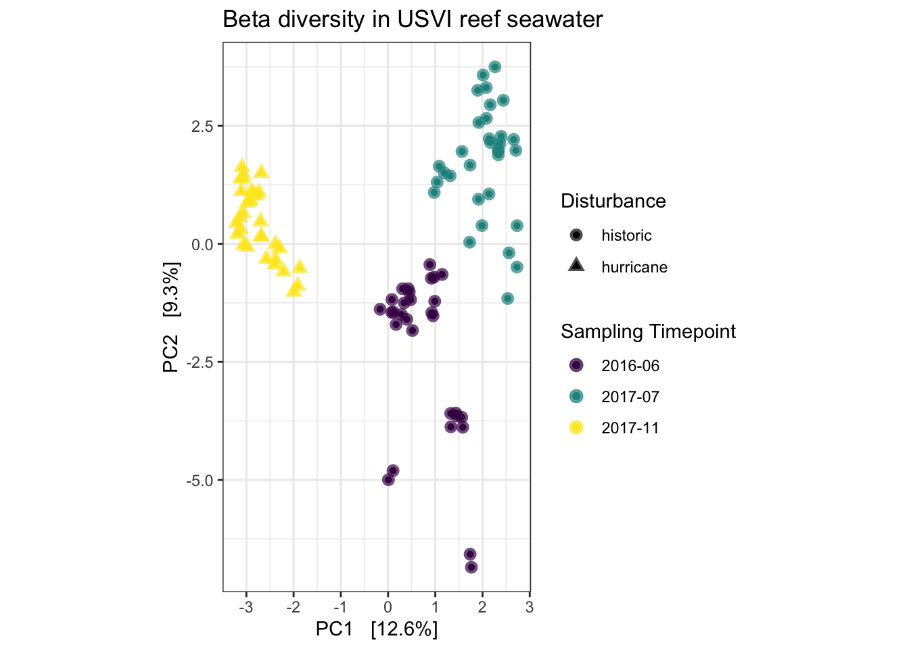

# Setup 

1. Include the `knitr` code to specify a path to save any generated figures from the R Markdown document. 
2. Change the `setwd` code to the location where your data analysis folder is, and where you decide to save this R markdown document. 
3. Set up your data analysis folder to include `./figures/` and `./data/` folders. This will help keep the analysis organized. 

```r
knitr::opts_chunk$set(echo = TRUE, fig.retina = 2, fig.path = "figures/fig-")
setwd("~/Documents/GitHub/Analysis_Publishing_Template")
```

# Data Analysis Prep

This is the section where you will save the packages, load your data, and create any functions for analyzing your data. 

## Load packages

```r
library(ggplot2)
theme_set(theme_bw()) # set this so all the plots look nice by default
library(phyloseq)
library(stringr)
library(microbiome)
library(vegan)
```

## Load data
This example data is 16S rRNA taxonomic microbiome data from US Virgin Islands seawater. The data have been low abundance filtered and represent data that went into the analysis in the following publication: https://enviromicro-journals.onlinelibrary.wiley.com/doi/10.1111/1462-2920.16610 

```r
## Read in data - use the low abundance filtered dataset
asv <- read.table("data/ASV_USVI-timeseries_smaller.txt",sep="\t",header=TRUE, row.names=1)
taxa <- as.matrix(read.table("data/taxonomy_USVI-timeseries_smaller.txt", sep="\t", header=TRUE, row.names=1))
samples <- read.table("data/metadata_USVI-timeseries_smaller.txt",sep="\t",header=T,row.names=1)

# Sample names have x's in them. Remove
colnames(asv) <- str_replace_all(colnames(asv), pattern = "[X]", "")
```

## Create phyloseq object

I create the phyloseq object and see that it has ~14,000 taxa in it. 

```r
ASV = otu_table(asv, taxa_are_rows = TRUE)
TAX = tax_table(taxa)
META = sample_data(samples)

ps <- phyloseq(ASV, TAX, META)
ps
```

```
## phyloseq-class experiment-level object
## otu_table()   OTU Table:         [ 14009 taxa and 104 samples ]
## sample_data() Sample Data:       [ 104 samples by 42 sample variables ]
## tax_table()   Taxonomy Table:    [ 14009 taxa by 7 taxonomic ranks ]
```

## Add custom functions
I include an example function here, but will not use it in the template. 

```r
# create a function that will return the values of interest from the Differential abundance test
# THis is for when there are two variables tested or compared to the control
extractmods1 <- function(model) {
  result <- data.frame("Estimate" = model$coefficients[2:3, 1], 
                        "Std.Error" = model$coefficients[2:3, 2], 
                        "p" = model$coefficients[2:3, 4])
  return(result)
}
```

# Analyze data

My goal here is to produce a couple of simple figures that will save and output so that you can see how they look when the file is uploaded to github. 

## Hard coral

**Question:** How does hard coral change across reef?      
**NOTE:** this graph will automatically save to the `figures/` folder when you knit the document. If this figure then gets added and pushed to github, it will show up in the output. 

```r
# Set levels so baseline/control is first
samples$site <- factor(samples$site, levels = c("Dittlif", "Cocoloba", "Joels Shoal", "Europa", "Yawzi", "Tektite", "Booby Rock", "Ram Head", "Sand patch"))

ggplot(samples, aes(x = site, y = HardCoral)) +
  geom_boxplot(outlier.shape = NA) +
  geom_jitter(position = position_jitter(width=.1, height=0), aes(colour = yearmonth), size = 3, alpha = 0.7) +
  labs(x = "Reef", y = "Percent Hard Coral", title = "Hard coral on St. John, USVI reefs", color = "Disturbance")
```

```
## Warning: Removed 51 rows containing non-finite outside the scale range
## (`stat_boxplot()`).
```

```
## Warning: Removed 51 rows containing missing values or values outside the scale range
## (`geom_point()`).
```


## Beta diversity

**Question:** Does microbial community composition change over time?    
**Approach:** Compute the beta diversity with Aitchison distance (Euclidean distance on clr-transformed data), then visualize beta diversity. Then use the adonis2 function from vegan to conduct a PERMANOVA. 

### Plot

```r
# Remove sand patch samples from phyloseq object
ps.beta <- ps %>% subset_samples(site != "Sand patch")

# transform the data
ps.beta_clr <- microbiome::transform(ps.beta, 'clr')
ps.beta_clr_euc <- ordinate(ps.beta_clr, "RDA", "euclidean")


plot_ordination(ps.beta_clr, ps.beta_clr_euc, type="samples", color = "yearmonth", shape = "disturbance") +
  coord_fixed() +
  geom_point(size = 3, alpha =  0.7) +
  scale_color_viridis_d() + 
  labs(color = "Sampling Timepoint", title = "Beta diversity in USVI reef seawater", shape = "Disturbance") 
```



### PERMANOVA

```r
# Do permanova (adonis test) to evaluate effect of reef and disturbance on composition.
clr_meta <- as(sample_data(ps.beta_clr), "data.frame")  # take the clr transformed data from the phyloseq object
clr_otu <- otu_table(ps.beta_clr) %>% as.matrix %>% t() #samples must be rows, so transpose

#get dissimilarity matrix using vegan
euc_diss <- vegdist(clr_otu, method = "euclidean")

# Does site and disturbance influence microbial community composition?
adonis2(formula = euc_diss ~ yearmonth, data = clr_meta, permutations = 999)
```

```
## Permutation test for adonis under reduced model
## Terms added sequentially (first to last)
## Permutation: free
## Number of permutations: 999
## 
## adonis2(formula = euc_diss ~ yearmonth, data = clr_meta, permutations = 999)
##           Df SumOfSqs     R2      F Pr(>F)    
## yearmonth  2    34821 0.2011 11.453  0.001 ***
## Residual  91   138331 0.7989                  
## Total     93   173152 1.0000                  
## ---
## Signif. codes:  0 '***' 0.001 '**' 0.01 '*' 0.05 '.' 0.1 ' ' 1
```

# Block quote testing

> We are learning so many fun things about block quotes and styling our R markdown documents with the styles.css document. Brianna showed us this fun styles tool. Thanks ChatGPT. 
